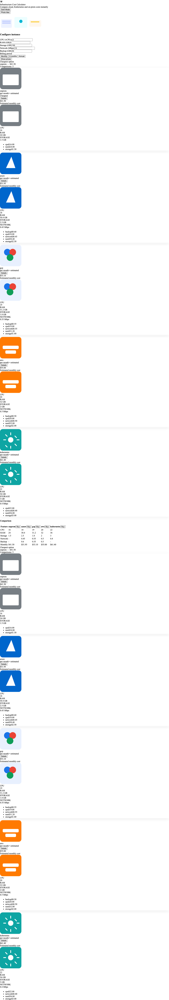

Infra Cost Calculator (Local)

Backend: Flask (port 5000)
Frontend: Next.js + Tailwind (port 3000)

Run backend first, then frontend.

## Backend - Development & Tests 🔧

1. Install runtime dependencies (from project root):

```bash
cd backend
python3 -m pip install -r requirements.txt
```

2. (Optional) Install dev/test dependencies:

```bash
python3 -m pip install -r requirements-dev.txt
```

3. Run the server locally:

```bash
python3 app.py
# or: FLASK_APP=app FLASK_ENV=development flask run --port=5000
```

4. Run tests:

```bash
python3 -m pytest -q
```

Notes:

## Frontend - Development & Local Testing 🖥️

1. Configure the API URL (optional - defaults to http://127.0.0.1:5000):

```bash
# Copy the example and edit if needed
cp frontend/.env.local.example frontend/.env.local
```

2. Install dependencies and run the dev server:

```bash
cd frontend
npm install
npm run dev -p 3000
# open http://localhost:3000
```

3. Manual test (UI):

Screenshot (desktop):



## E2E tests (Playwright)

1. Install Playwright dev dependency and browsers:

```bash
cd frontend
npm install
npx playwright install
```

2. Start the dev server (in one terminal):

```bash
npm run dev -p 3000
```

3. Run E2E tests (in another terminal):

```bash
npm run test:e2e
```

The E2E verifies Azure and GCP totals are displayed and non-zero using a headless Chromium instance.


---

## AWS MVP: instance-based pricing (new)

This project includes an MVP for AWS instance-based pricing:

- A compact instance catalog is available at `backend/data/aws_catalog.json` with representative SKUs and on-demand hourly prices (placeholders).
- The backend implements a simple matcher (`backend/utils/aws_catalog.py`) that selects the nearest instance SKU for a CPU/RAM request and computes the monthly instance cost using SKU hourly price.
- `backend/cloud_providers/aws.py` uses the matcher and returns `selected_instance` metadata in the `/calculate` response (fields: sku, count, price_per_hour, price_per_month).

Notes & next steps:

- The MVP uses a small in-repo catalog. For production-grade accuracy, we recommend adding a price-sync job that fetches real catalog data from AWS Pricing API and updates per-SKU `price_per_hour` values.
- After AWS is working, the same approach can be applied to Azure and GCP.
 
### Running the AWS price sync

You can sync on-demand hourly prices from AWS using either the public EC2 offerings (no credentials required) or the AWS Pricing API.

**Option 1: Public EC2 Offerings (Recommended — no credentials required)**

```bash
cd backend
python -m utils.aws_price_sync --public --write-catalog
```

This downloads the public EC2 offerings JSON file (shared tenancy, Linux, on-demand pricing for the specified region) and extracts prices for your catalog SKUs. It writes a cache at `backend/cache/aws_prices.json` and with `--write-catalog` updates the `price_per_hour` values in `backend/data/aws_catalog.json`.

**Option 2: AWS Pricing API (requires AWS credentials)**

```bash
cd backend
python -m utils.aws_price_sync --write-catalog
```

This uses boto3 to query the AWS Pricing API (requires AWS credentials and IAM permissions for pricing:GetProducts). Results are cached and optionally written to the catalog.

**Common options**

- `--location`: Specify an AWS region (default: 'US East (N. Virginia)'). Examples:
  - 'US East (N. Virginia)'
  - 'US West (Oregon)'
  - 'EU (Ireland)'
  - etc.

Example with custom location:

```bash
python -m utils.aws_price_sync --public --write-catalog --location "EU (Ireland)"
```

## CI status

The project runs unit tests and E2E tests on PRs via GitHub Actions. Add a status badge after you push the repo to GitHub (replace <OWNER> and <REPO>):


How to update badge for your repo:

1. Replace `<OWNER>` and `<REPO>` in the badge URL above with your GitHub username/organization and repository name.
2. After pushing to GitHub, visit the Actions tab → `backend-ci` to view logs for any failed jobs.

Tip: If you want, tell me your GitHub `owner/repo` and I’ll add the badge for you.


